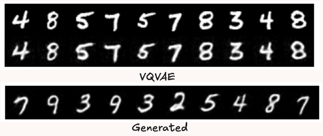
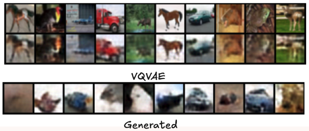

# Minimal Implementation of Visual Autoregressive Modelling (VAR)

This is a minimal PyTorch implmentation of the [Visual Autoregressive Modeling: Scalable Image Generation via Next-Scale Prediction](https://arxiv.org/pdf/2404.02905) paper (NeurIPS'24 best paper).

The entire thing is in 3 simple, self-contained files, mainly for educational and experimental purposes. Code also uses [Shape Suffixes](https://medium.com/@NoamShazeer/shape-suffixes-good-coding-style-f836e72e24fd) for easy readibility. 
- `vqvae.py`: The VQVAE implementation with the residual quantization 
- `var.py`: The transformer and sampling logic 
- `main.py`: A simple training script for both the VQVAE and the VAR transformer.

## To Use 
You will need PyTorch and WandB (if you want logging)
```bash
pip install torch torchvision wandb[media]
```

To train on MNIST,
```bash
python main.py
```
<p style="text-align: center;">
  
  <br>
  <i>VQVAE construction and generated samples with VAR on MNIST</i>
</p>


There is also CIFAR10 support,
```bash
python main.py --cifar
```

<p style="text-align: center;">
  
  <br>
  <i>VQVAE construction and generated samples with VAR on CIFAR10. (Random class labels) </i>
</p>

> Change the model and training params in `main.py` as required 

## Discussion 
The architecture implemented here is a little different from the one in the paper. The VAVAE is just a simple convolution network. The transformer mainly follows the [Noam Transformer](https://gist.github.com/nreHieW/a4ae05d216c5326c9fb9a70fcdda3274) with adaptive normilization (from [DiT](https://arxiv.org/abs/2212.09748)) - Rotary Positional Embedding and SWIGLU mainly. For simplicity, attention is still standard Multi-Head Attention. The VQVAE is also trained on standard codebook, commitment and reconstruction losses without the perceptual and GAN loss terms that is standard.

The performance on CIFAR is not as good compared to MNIST. My hypothesis is that the the encoder-decoder of the VQVAE just isn't good enough. The codebook is not representative enough. As a result, while training loss on VAR has yet to converge, the samples tend to get worse. 


### Acknowledgements
Original code by the authors can be found [here](https://github.com/FoundationVision/VAR). This repository is mainly inspired by [Simo Ryu's minRF](https://github.com/cloneofsimo/minRF/tree/main) and the VQVAE Encoder/Decoder is from [here](https://github.com/karpathy/deep-vector-quantization/blob/main/dvq/model/deepmind_enc_dec.py).

```
@Article{VAR,
      title={Visual Autoregressive Modeling: Scalable Image Generation via Next-Scale Prediction}, 
      author={Keyu Tian and Yi Jiang and Zehuan Yuan and Bingyue Peng and Liwei Wang},
      year={2024},
      eprint={2404.02905},
      archivePrefix={arXiv},
      primaryClass={cs.CV}
}
```


If you found this repository useful,
```
@misc{wh2025minVAR,
  author       = {nreHieW},
  title        = {minvAR: Minimal Implementation of Visual Autoregressive Modelling (VAR)},
  year         = 2025,
  publisher    = {Github},
  url          = {https://github.com/nreHieW/minVAR},
}
```
This was mainly developed on Free Colab and a rented cloud 3090, so if you found my work useful and would like to sponsor/support me, do [reach out](https://x.com/nrehiew_) :)
